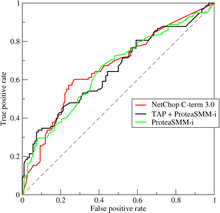

# Evaluation Standard
### Accurency/Precision/Recall/F1/ROC/AUC

## Accurency
accurency = right / all (right: the instance you predict right, all； all sample)
## Precision and Recall and F1
### 1. confusion matrix
TP: true positive   FN: false negative

FP: false positive   TP: True negative

### 2. Precision
P = TP/(TP + FP)

It refers to the accurency rate of you prediction
### 3. Recall
R = TP/(TP + FN)

It refers to the comprehensive rate of your prediction

### 4. Precision and Recall's description
The Precision and Recall are often in conflict with each other, so if one P-R curve is completely wrapped by another, then we can assume that the latter is better.
### 5. F1
F1 is the harmonic mean of the precision and recall

definition: F1 = (2 * P * R)/(P + R)

If we want to give a weight to the each evaluation method, then we can use the β like this

F1 = (1 + β^2) * P * R/((β^2 * P) + B)

### 6. extension and application
Sometimes we some other situation:
* have trained and tested quite a few times and we get severial confusion matrix  
* have trained and tested in different datasets, hoping to evaluate the algorithm as a whole
* for Multi-category tasks, we combine each two category into a confusion matrix

one method:

calculate each Precision and Recall in different confusion matrix and then calculate the mean of them(called macro-P, macro-R and macro-F1)

macro-P = 1/n * ∑P 
macro-R = 1/n * ∑R
macro-F1 = (2 * macro-P * macro-R)/(macro-P + macro-R)

another method:

calculate the mean of TP, FP, FN, TN, then calculate the micro-P, micro-R and micro-F1
## ROC and AUC

So many learning model generate a value or probablity prediction and then compare it with the threshold. Then we cansort the value and get a cut point and divide the sample into two part. So the quality of sorting represent the ability of generalization, anfd we can use the ROC curve

If we assume that one marker is (x, y), then if the next sample is the true positive, then the coordinate of it is (x, y + 1/m+), and if it is false positive, then the coordinate of it is (x + 1/m-, y)

Just like above, if one learning model's ROC curve is wrapped by the another, then the latter is better. Another method to measure is to compare the *Areas Under the ROC Curve*(**AUC**)

defintion: AUC = 1/2 ∑(xi+1 - xi) * (yi + yi+1)   *i from 1 to m-1*

AUC is the evaluationof the quality of prediction sorting, if we have m+ positive example and m- negative example, and D+ and D- represent positive and negative set, then we can define loss as:

lrank = 1/m+ * m- ∑ ∑ (II(f(x+) < f(x-)) + 1/2 * II(f(x+) = f(x-)))

This means that if the positive prediction value is smaller than the negative, then you are punished by one point, the same as another. We can find that AUC = 1 - lrank

